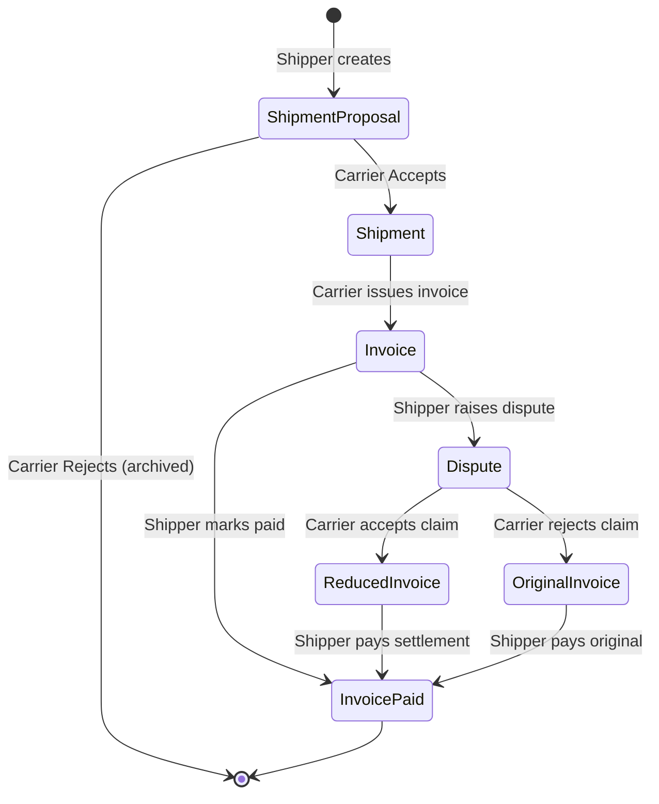
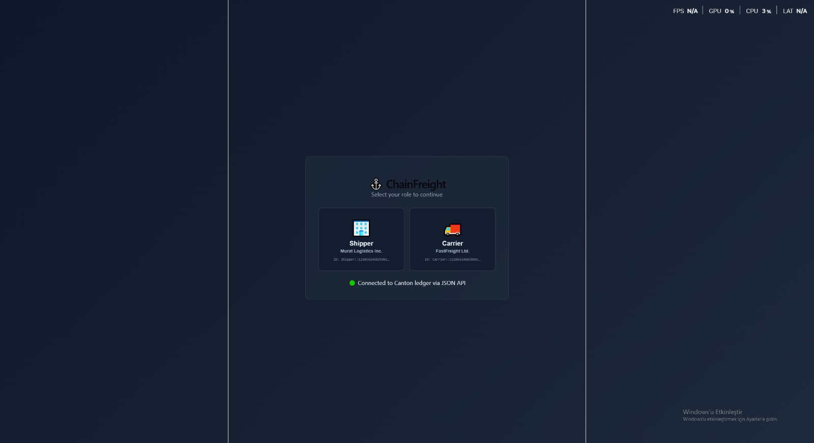
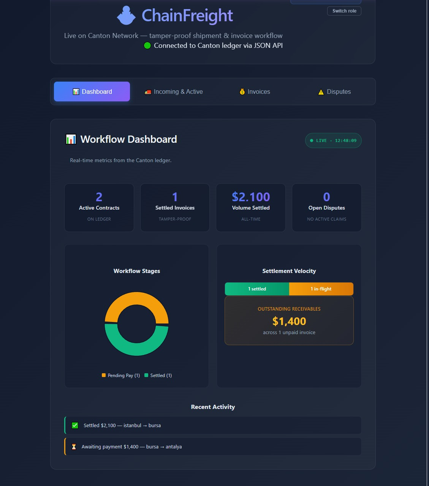
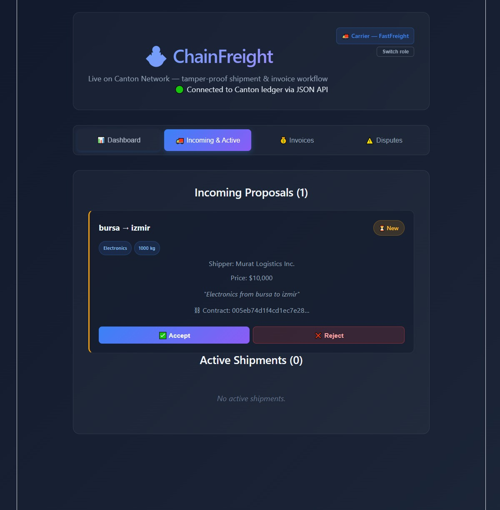
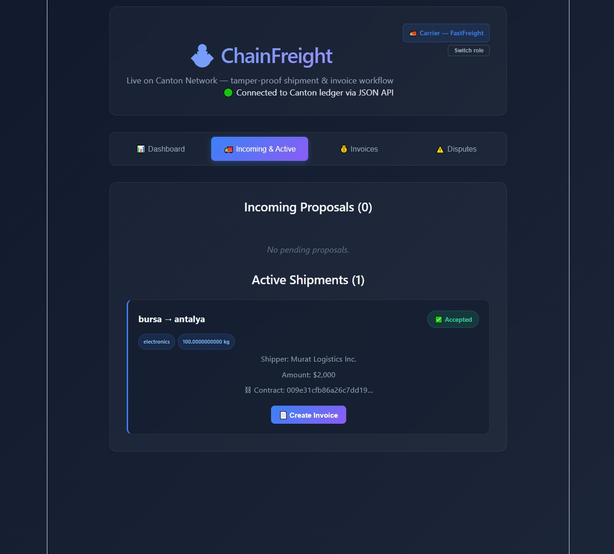
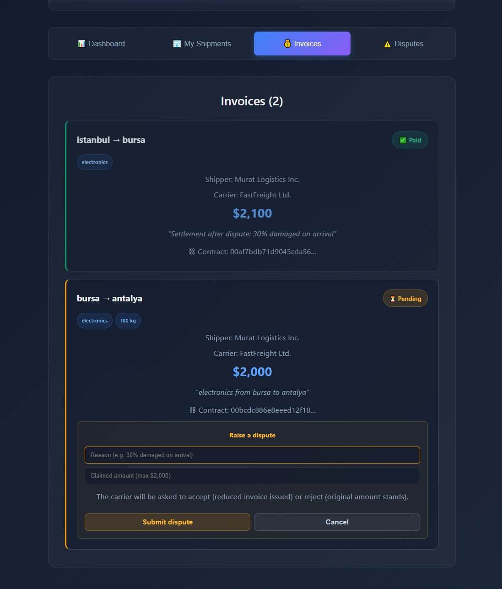
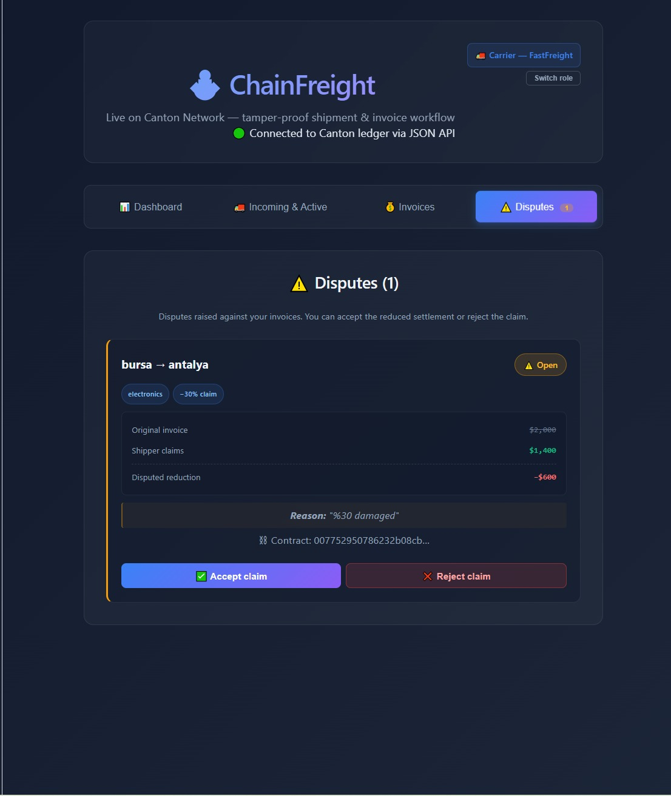

# ChainFreight

**Stop reconciling spreadsheets. Start agreeing on a single source of truth.**
> 🌐 **Live demo:** https://canton-logistics-invoice.vercel.app  
> 📺 **Demo video:** https://youtu.be/HT-yrPHfErk *(re-record in progress)*  
> 🛠 **Repo:** https://github.com/CMZS4/canton-logistics-invoice
Tamper-proof shipment & invoice workflow on Canton Network — proof, not promises.

> HackCanton League Season #1 — RWA & Business Workflows Track

[]()
[]()
[]()
[]()

## TL;DR — demo in 30 seconds

1. Pick a role (Shipper or Carrier) on the live Canton ledger
2. Shipper creates a shipment proposal
3. Switch role → Carrier accepts → Shipment contract created
4. Carrier issues an invoice
5. Shipper raises a dispute on the invoice
6. Carrier resolves the dispute (accept claim / reject claim)
7. Final invoice paid → Dashboard updates in real time

→ **Every step is a real Canton transaction.**
→ **No backend reconciliation. The ledger is the workflow.**

## Why a ledger, not a database?

Today, Murat — operations manager at a Turkish freight forwarder — spends 3 to 5 hours a week arguing over invoices he cannot prove. WhatsApp screenshots, edited Excels, mismatched email threads. A shipper and a carrier disagree on what was shipped, what was invoiced, what was paid, and what's in dispute, and there's no shared record either side can trust.

A traditional database doesn't solve that, because *whose* database is it? Whoever owns it can edit the record.

ChainFreight runs the workflow as Daml smart contracts on Canton, where:

- **Both parties co-sign every transition.** A shipper cannot mark their own invoice paid for the carrier; a carrier cannot unilaterally settle a dispute.
- **Selective disclosure is enforced by the ledger.** Each role only sees the contracts they're authorized to see — not by hiding things in the UI, but by signatory and observer rules in the Daml code.
- **The state machine cannot be bypassed.** `assertMsg` checks (no double-pay, no dispute on a paid invoice, no claim above the invoice amount) live on the ledger, so the UI is just a thin client over a tamper-proof workflow.

## Why Canton, not Postgres / Ethereum / Hyperledger?

A fair question. ChainFreight needs **shared truth across companies that don't fully trust each other** — that ruled out three plausible alternatives:

| | What it does well | Why it doesn't fit |
|---|---|---|
| 🗄️ **Postgres** | Fast, familiar, perfect for centralized apps with one operator. | Whoever owns the database becomes the source of truth. Disputes return to *"whose version is right?"* — the exact problem we're solving. |
| ⛓️ **Ethereum** | Strong public verifiability, composable smart contracts, settlement guarantees. | Shipment prices, customer terms, and counterparty data don't belong on a public chain. B2B workflows need **confidentiality** as much as integrity. |
| 🏢 **Hyperledger** | Permissioned enterprise networks, configurable governance. | Privacy and selective disclosure require manual design at the application layer. Canton gives the same outcome with a cleaner native model. |
| ✅ **Canton** | **Multi-party workflows with native privacy, selective disclosure, and cryptographic co-signing — designed for B2B coordination from day one.** | *— this is what we picked* |

**Why Canton's fit is structural, not stylistic:**

- 🔐 **Multi-party authorization** — every state transition (Accept, CreateInvoice, RaiseDispute, AcceptClaim) is co-signed. No single party rewrites history.
- 👁️ **Privacy by default** — only the parties on a contract see it. The carrier doesn't see another shipper's invoices; the network doesn't see anyone's prices.
- 🧩 **Selective disclosure** — adding a customs broker or freight forwarder later doesn't require redesigning who sees what.

> Postgres scales the operator. Ethereum scales the public.  
> **Canton scales the agreement** — which is what logistics actually needs.

## What makes this different?

No backend database.
No reconciliation jobs.
No "source of truth" debates.

The ledger *is* the workflow. Every state transition is a signed Canton transaction. There is no off-ledger version to argue with.

---

## The Problem

SME freight forwarders lose **3–5 hours every week** resolving shipment and invoice disputes. The only proof lives in WhatsApp, Excel, and email — tools that can be edited, lost, or deleted.

When the operations manager can't prove the carrier's side, the forwarder absorbs the cost.

## The Solution

ChainFreight puts the shipment-to-invoice workflow on **Canton Network** as tamper-proof smart contracts with selective disclosure. Every shipment, acceptance, invoice, and payment becomes a verifiable, immutable ledger record. Each party sees only what they are allowed to see.

**What took 3 hours of manual reconciliation now settles in under 2 minutes.**

---

## The Workflow



The happy path:

```
Shipper creates proposal
         ↓
Carrier accepts → Shipment contract (or rejects, archived)
         ↓
Carrier issues Invoice
         ↓
Shipper marks paid → isPaid: true
```

The dispute path (when something goes wrong):

```
…Invoice exists
         ↓
Shipper raises Dispute (reason + claimed amount)
         ↓
Carrier resolves:
   ├─ AcceptClaim → reduced Invoice
   └─ RejectClaim → original Invoice reissued
         ↓
Shipper pays the resolved Invoice
```

Every transition is a real Canton transaction signed by the required parties. The on-ledger state machine — not the UI — decides what is allowed.

---

## Architecture

```
React + Vite Frontend
        ↓
Canton JSON Ledger API (port 7575)
        ↓
Canton Sandbox + Daml contracts
(ShipmentProposal · Shipment · Invoice · Dispute)
```

---

## Tech Stack

- **Daml 3.4.11** — smart contract language
- **Canton Network** — distributed ledger
- **React 19 + Vite** — frontend
- **JSON Ledger API** — ledger access over HTTP
- **Docker + Ubuntu WSL2** — dev environment

---

## Screenshots

### Sign in as Shipper or Carrier
Each role gets a separate session, with its own party ID issued by the Canton ledger.



### Real-time analytics from the ledger
KPI cards, workflow stage donut, settlement velocity, and an activity feed — all derived from active contracts.



### Carrier reviews incoming proposals — Accept or Reject
Both choices are live on the ledger: Accept creates a Shipment, Reject archives the proposal.



### Carrier issues an invoice
Once a shipment is in transit, the carrier can issue an invoice — both shipper and carrier co-sign it on the ledger.



### Shipper raises a dispute
If something went wrong, the shipper raises a dispute with a reason and a claimed amount — capped at the original invoice on-ledger.



### Carrier resolves the dispute
The carrier accepts the claim (reduced invoice issued) or rejects it (original amount stands). Either path is enforced as a Daml choice.



## Quick Start

You'll need [Daml SDK 3.4.11](https://docs.daml.com/getting-started/installation.html), Java 17, and Node.js 20+.

```bash
# 1. Clone and enter the repo
git clone https://github.com/CMZS4/canton-logistics-invoice.git
cd canton-logistics-invoice

# 2. Start the Canton sandbox + JSON Ledger API (keep this running)
daml start

# 3. In a second terminal, allocate the two parties
curl -X POST http://localhost:7575/v2/parties \
  -H "Content-Type: application/json" \
  -d '{"partyIdHint":"Shipper","displayName":"Murat Logistics"}'

curl -X POST http://localhost:7575/v2/parties \
  -H "Content-Type: application/json" \
  -d '{"partyIdHint":"Carrier","displayName":"FastFreight"}'

# 4. In a third terminal, start the React frontend
cd frontend
npm install
npm run dev

# 5. Open http://localhost:5173 — pick a role and go
```

To run the Daml test suite:

```bash
daml test
```

You should see all five scenarios pass: `testLogistics`, `testReject`, `testDisputeAccepted`, `testDisputeRejected`, `testEdgeCases`.

The first four scenarios cover the happy path and the dispute branches. **`testEdgeCases` exists specifically to prove that the ledger rejects abuse**, using `submitMustFail` to assert that the following commands all fail at submission time:

- claiming more than the original invoice amount (over-claim)
- claiming zero or a negative amount
- raising a dispute on an already-paid invoice
- marking an invoice paid twice (double-pay)

Each failure path is enforced by an `assertMsg` or `ensure` clause inside the contract, not by the UI. A misbehaving client cannot bypass them.

## Smart Contracts

Four Daml templates, all live on ledger.


### ShipmentProposal
- **Signatory:** Shipper
- **Observer:** Carrier
- **Choices:** `Accept` (creates Shipment), `Reject` (auto-archives)
- **Validation:** `ensure price > 0.0 && weightKg > 0.0`

### Shipment
- **Signatories:** Shipper + Carrier (both required)
- **Choice:** `CreateInvoice` (controller: Carrier)

### Invoice
- **Signatories:** Shipper + Carrier
- **Choices:**
  - `MarkPaid` (controller: Shipper) — guarded against double-pay
  - `RaiseDispute` (controller: Shipper) — see Dispute below
- **Validation:** `ensure amount > 0.0`

### Dispute
- **Signatories:** Shipper + Carrier
- **Status:** typed enum (`Open` | `Resolved`)
- **Choices:**
  - `AcceptClaim` (controller: Carrier) — issues a new Invoice with the claimed amount
  - `RejectClaim` (controller: Carrier) — reissues the original Invoice

The Dispute template is the difference between a happy-path demo and a real B2B workflow. Forwarders don't lose 3-5 hours a week on shipments that go right — they lose them on shipments that go wrong, and on having no shared, tamper-proof record of what was agreed.

### Type-safety details

- `DisputeStatus` is a Daml ADT, not a free-form string. Typos are rejected at compile time.
- `claimedAmount <= amount` is enforced inside `RaiseDispute`, not in the UI.
- All `assertMsg` checks (double-pay, dispute on already-paid invoice, status-already-resolved) run on the ledger — the UI cannot bypass them.

### A note on contract lifecycle (and a common misreading)

Reviewers sometimes ask: "do these contracts get archived after they're resolved? I don't see `archive self` in the code, so isn't the old contract still active alongside the new one?"

No — and adding `archive self` would actually be a bug. In Daml, choices are **consuming by default**, which means the contract on which the choice is exercised is archived as part of the same transaction. There is exactly one active contract representing the workflow at any moment.

Concretely:

- `Accept` archives the `ShipmentProposal` and creates a `Shipment`.
- `Reject` archives the `ShipmentProposal` with no replacement.
- `CreateInvoice` archives the `Shipment` and creates an `Invoice`.
- `MarkPaid` archives the unpaid `Invoice` and creates a paid one.
- `RaiseDispute` archives the `Invoice` and creates a `Dispute`.
- `AcceptClaim` / `RejectClaim` archives the `Dispute` and creates a fresh `Invoice` (reduced or original).

The state machine is the **single source of truth** — there is no ambiguity about "which invoice should I pay?" because there is exactly one active invoice at every step.

You can verify this from `daml test` output:

```
testReject:           0 active contracts, 2 transactions
testLogistics:        1 active contracts, 4 transactions
testDisputeAccepted:  1 active contracts, 6 transactions
testDisputeRejected:  1 active contracts, 6 transactions
testEdgeCases:        1 active contracts, 8 transactions
```

`testReject` proves the consuming pattern: a proposal was created and rejected; the resulting active-contract count is **zero**. If old contracts were lingering, this would not be possible. Adding an explicit `archive self` to a consuming choice would cause Daml to fail with `Attempt to exercise a contract that was consumed in the same transaction` — Daml's type system catches the double-archive at runtime.

> Note: On Windows CMD, the Turkish locale can cause a `DAML-LF Name "SCRİPT"` parsing error. Run tests in WSL/Ubuntu or set `JAVA_TOOL_OPTIONS=-Duser.language=en` first.

---
## Live demo vs. local sandbox

ChainFreight runs in two modes against the **same Daml package**:

**Local mode** (real Canton sandbox):
The frontend talks to a Canton sandbox running on `localhost:7575`.
Every action is a signed Canton transaction. This is the real
system — see Quick Start above to run it yourself.

**Demo mode** (`VITE_MOCK_MODE=true`, used on Vercel):
A static deploy uses an in-memory simulation of the same state
machine, because a sandbox running on a developer laptop isn't
reachable from the public internet. The UI behavior, validations,
and consuming-choice semantics are reproduced for demo purposes —
**but the real ledger runs the actual Daml package, unchanged.**

The mock layer exists only because the real ledger needs a
locally-running participant node. The smart contracts, signatory
rules, and state machine you see in `daml/Logistics.daml` are
what run on Canton.
## Demo

**Live demo:** _[deployed URL coming soon]_


**Walkthrough video** (older version, to be re-recorded): [https://youtu.be/HT-yrPHfErk](https://youtu.be/HT-yrPHfErk)

What you'll see in the live demo:
- A role selector that pulls real party IDs from `/v2/parties`
- Each role only sees actions it is authorized to perform on the ledger
- Every click triggers a real Canton transaction with toast feedback
- Full dispute lifecycle: raise → resolve → settlement

---

## Project Status

- [x] Daml smart contracts — 4 templates, 5 test scenarios, ledger-side validation
- [x] Canton sandbox running locally
- [x] JSON API integration verified via `curl`
- [x] React frontend connected to live ledger
- [x] End-to-end workflow working (browser → API → ledger)
- [x] Dynamic role selector (party IDs fetched from ledger)
- [x] Toast notifications for every ledger action
- [x] Role-aware UI (each party only sees authorized actions)
- [x] Reject flow (proposal archived on reject)
- [x] Dispute workflow (raise → accept/reject → settlement)
- [x] Real-time analytics dashboard (KPIs, donut chart, activity feed)
- [x] Structured shipment data (origin, destination, cargoType, weightKg)
- [x] Type-safe dispute status (Daml ADT, not string)
- [x] Submission demo video (older version — to be re-recorded)
- [ ] Live web deployment (Vercel)
- [ ] Production deployment (Canton devnet)
- [ ] Pilot with real freight forwarder

---

## Target User

**Murat** — Operations manager at a mid-sized Turkish freight forwarder handling ~120 shipments/month across multiple carriers. Pain: absorbing dispute costs because there's no tamper-proof record of who agreed to what.

**Market:** ~2,700 SME freight forwarders in Turkey alone, part of an industry where manual reconciliation and documentation errors are a major cost center.

---

## Architecture & Design Decisions

A few things in the codebase look like shortcuts but are deliberate. Documenting them so reviewers don't have to guess:

**Party discovery via partyIdHint prefix.** The frontend looks up parties by matching the `partyIdHint` prefix (`Shipper::…`, `Carrier::…`) against the `/v2/parties` response. This works against a Canton sandbox where parties are allocated with known hints. A production deployment would replace this with authenticated identity (JWT/OAuth) and a proper user-to-party mapping service. The sandbox-only pattern keeps the demo path uncluttered.

**Polling instead of streaming.** The frontend refreshes via `/v2/state/active-contracts` every 3 seconds. Canton supports gRPC streaming and PQS projections that scale far better, but they add infrastructure (a streaming client, an event consumer) that doesn't change the user-visible workflow. Polling was the right tradeoff for a 21-day MVP. See "Future Extensions" for the production path.

**Frontend guards are UX, not security.** The UI hides the "Mark as Paid" button from the carrier and the "Accept claim" button from the shipper. This is for clarity, not safety. The actual authorization is enforced by Daml signatories and choice controllers — the ledger rejects any unauthorized command, regardless of which UI sent it. Hand-rolled curl against the JSON API would hit the same wall.

**Per-template field duplication (origin, destination, etc.).** Each template carries its own copy of the freight metadata. A normalized reference model would be cleaner, but it would also require either a separate "ShipmentRef" template or a reference parameter pattern that complicates the choice signatures. For an MVP this duplication is intentional — the cost is a few extra fields, the benefit is templates that read top-to-bottom without indirection.

**`createdAt` carries through the workflow.** The `createdAt` timestamp on `ShipmentProposal` propagates onto the `Shipment` and the original `Invoice`, but choices that *create new contracts* in the dispute flow (`AcceptClaim`, `RejectClaim`) stamp them with `getTime` at exercise time. So `createdAt` answers two related but distinct questions: "when was the workflow opened?" (proposal time) and "when was this specific invoice issued?" (exercise time for post-dispute invoices). A future version could split these into `workflowStartedAt` and `issuedAt` for clarity.

## Why Canton wins here

This problem is not about automation.

It's about **agreement**.

A database automates your version of the truth.
Canton lets multiple parties agree on a shared truth — with cryptographic signatures, selective disclosure, and a state machine that no single party can rewrite.

That's the difference between automating a workflow and trusting it.

## What's Real, What's Next

**Live today:**
- Four Daml contract templates on Canton sandbox
- Happy path: propose → accept → invoice → pay
- Dispute path: raise → accept claim (reduced invoice) | reject claim (original reissued) → pay
- Multi-party signatures + selective disclosure enforced by the ledger
- Real-time analytics dashboard derived from active contracts

**Next:**
- Deploy to Canton devnet (live network)
- Pilot with one real freight forwarder for production validation

## Future Extensions

The MVP focuses on the multi-party state machine. A production deployment would naturally extend it with:

- **Proof of Delivery (PoD)** as a new state between `Shipment` and `Invoice`. The carrier would submit a signed PoD record (timestamp, location, recipient signature hash) before an invoice can be issued — preventing premature billing and matching the real freight-forwarding workflow.
- **Document attachments** (bill of lading, weighing tickets, customs paperwork) stored off-ledger on IPFS or S3, with their SHA-256 hashes recorded on-ledger as immutable proof of document existence at a specific time.
- **Mediation / auditor party** as a third signatory on the `Dispute` template. When both parties disagree on the resolution (e.g. shipper rejects the carrier's `RejectClaim`), an industry chamber or arbitrator can break the deadlock without leaving the ledger.
- **Tax & VAT fields** on the `Invoice` template (`vatRate`, `vatAmount`, `taxId`, `currency`) — required by Turkish KDV regulations and most EU jurisdictions for legal invoice archival.
- **Sequential invoice numbers** (zorunlu in Turkey) and per-jurisdiction legal numbering rules.
- **Partial payment / partial damage** flows. Currently dispute resolution issues a single new invoice; partial-payment would let an invoice accumulate multiple `MarkPaid` events until fully settled.
- **Streaming subscription API** instead of the 3-second polling used today. Canton supports gRPC streaming and PQS projections that would scale far better than the current REST-based approach.

These are deliberately deferred from the MVP to keep the demo focused on the core insight: **the multi-party state machine has to be on a shared ledger.** Once that's accepted, the rest are straightforward Daml record additions.

---

## Security & Trust Model

ChainFreight inherits Canton's multi-party authorization model end-to-end:

- **Signatories.** Every contract requires both Shipper and Carrier as signatories on `Shipment` and `Invoice`. Neither party can unilaterally create, modify, or settle a contract — both must authorize.
- **Selective disclosure.** A `ShipmentProposal` is signed by the Shipper and only observed by the named Carrier. Other parties on the ledger cannot see it.
- **Choice controllers.** Each state transition is gated by a specific party: only the Carrier can `Accept` a proposal, only the Shipper can `MarkPaid` an invoice.
- **Double-payment guard.** The `MarkPaid` choice carries an `assertMsg "Invoice is already paid" (not isPaid)` check enforced ledger-side. Replay attempts fail at the ledger, not the UI.
- **Tamper-proof history.** Every action — create, accept, invoice, pay — is an immutable Canton transaction. There is no "edit" path.

The frontend never holds private keys; all submissions go through the participant node via the JSON Ledger API, with `actAs` tying the request to a Canton party.

## Known Limitations

We list these explicitly because they matter for any production conversation:

- **Polling, not streaming.** The UI refreshes via `/v2/state/active-contracts` every 3 seconds. For production, Canton's gRPC streaming or PQS-backed subscriptions would replace polling.
- **`details: Text` payload.** Shipment details are intentionally a free-text field for the hackathon. A production schema would split origin, destination, INCO terms, weight, and cargo type into typed fields.
- **Single sandbox, single domain.** No devnet deployment yet. The same Daml package is deploy-ready for Canton devnet; the work is operational, not architectural.

## License

Apache 2.0